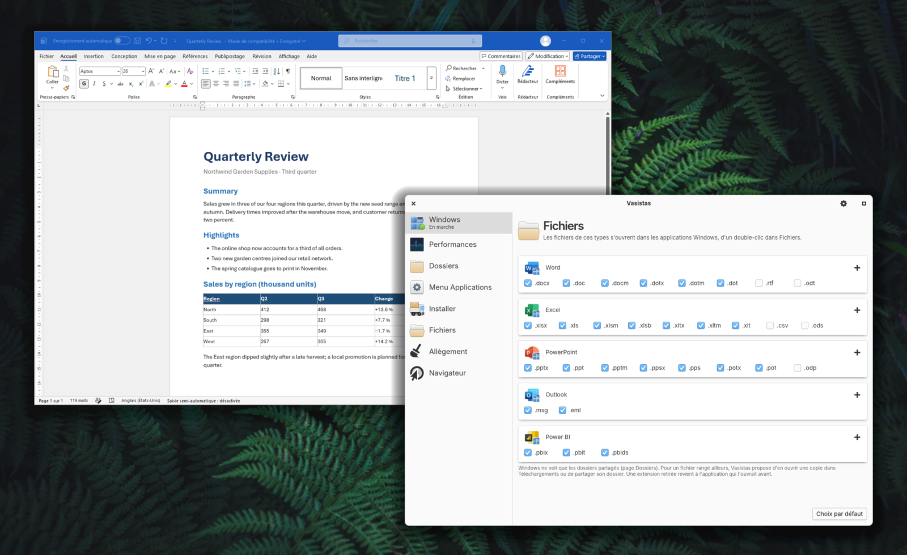

<p align="center">
  
</p>

<h1 align="center">Vasistas</h1>

<p align="center">Windows applications on the Linux desktop, one window at a time.<br>
Not a remote desktop: a controlled, lightweight virtual machine, smooth enough for professional tools.</p>

<p align="center">
  
  <br>
  <sub>Word, running in the Windows virtual machine, next to the Vasistas companion app.</sub>
</p>

Vasistas runs Windows in a virtual machine and shows its applications on your Linux desktop as
if they belonged there. Word, Excel or Power BI open from the Applications menu, get their own
icon in the dock, and move, resize and switch like any other window. The Windows desktop itself
stays out of sight: you only see the applications you use.

This is not a remote desktop application. Windows runs on your own computer, and Vasistas
treats it that way: no remote session and no video stream, but a virtualization we keep under
control, as light as we can make it and smooth enough for the professional tools you work with
every day.

It is built for elementary OS and should work on other Debian and Ubuntu based systems with
GTK 4 and Granite. Version 0.5 is an early, experimental release.

## Our approach

Controlled, because each piece is chosen and kept in hand: the virtual machine is started
directly with QEMU, the screen, keyboard, mouse and clipboard go through our own channel, and a
small agent inside Windows takes care of the windows. Windows itself is installed from
Microsoft's media with settings made for this use, such as no lock screen and updates only when
you decide.

Light, because nothing is encoded or decoded: the screen is read from memory shared with the
virtual machine. Windows pauses when you are not using it, memory it does not need goes back to
Linux as it goes, and an optional step removes telemetry and services that serve no purpose
here. On our machine, with Outlook open, the virtual machine uses about 4 GB of the 8 GB it is
given.

Smooth enough for work: typing, scrolling and moving between Word, Excel, Outlook or Power BI
stay fluid, and in our measurements a key press shows on screen within roughly 25 to 40
milliseconds. It is not tuned for 3D or games, as explained below.

## The experience we are aiming for

- Each Windows application window is a real window of your desktop, with its own entry in the
  dock and in the window switcher. Menus, dialogs and tooltips appear where you expect them.
- Your Documents and Downloads folders show up as drives in Windows, and Windows' own
  Documents, Pictures or Downloads folders can point to them. Double-clicking a `.docx`, `.xlsx`
  or `.pbix` file in Files opens it in the matching Windows application.
- Text, formatted text and images copy and paste between both sides.
- Windows plays sound through PipeWire and can use your microphone; the microphone is only
  read while a Windows application has it open. Sound can be turned off in the companion app.
- Windows takes the scale of the screen that holds most of its windows, and windows on that
  screen are shown pixel for pixel, so text stays sharp. Clicking from one screen to another
  changes nothing; moving windows across does, once they are dropped.
- Windows pauses itself when you are not using it and resumes on the next click; memory it does
  not need goes back to Linux.
- A setup assistant downloads Windows from Microsoft in the language you pick, installs it
  unattended with a local account, then installs Microsoft Office and other common
  applications.
- A companion app starts or stops Windows, chooses which applications appear in the menu,
  decides which file types open in Windows, trims Windows down and checks for updates.
- Experimental: windows whose title bar is drawn by Windows (File Explorer, classic dialogs)
  can get the desktop's own title bar instead, with its rounded corners and shadow. Office, Edge
  and applications that draw their own title bar keep theirs. Turn it on in the companion app,
  under Windows > Appearance.

## How it works

Windows runs in a QEMU/KVM virtual machine on your computer. Instead of streaming a remote
desktop, Vasistas reads the Windows screen directly from QEMU's shared memory (D-Bus display),
so nothing is encoded or sent over a network. A small agent inside Windows reports where each
window is and receives mouse, keyboard and clipboard events over a virtio channel. On the Linux
side, each Windows window becomes a GTK 4 window showing its part of the screen, labelled with
the application's own identity so the desktop can group and decorate it properly. Folders are
shared with virtio-fs.

The technical details are in [docs/ARCHITECTURE.md](docs/ARCHITECTURE.md) and the host/agent
protocol in [PROTOCOL.md](PROTOCOL.md).

## What it is not

Vasistas is meant for desktop applications, not for games. Without a graphics card passed to
the virtual machine, Windows renders in software: office and business applications stay
responsive, but 3D, demanding video and games do not, and anti-cheat systems usually refuse
virtual machines. Passing a dedicated graphics card to Windows is possible but experimental.

There is no webcam or USB passthrough yet, and the interface is currently in French only.

### Sharpness on several screens

Windows has a single display, so a single scale. When your screens use different scales, for
example an external monitor at 100 % and a laptop screen at 200 %, only the windows on one of
them can be drawn by Windows at the right size. Windows on the other screen are resized by
the desktop and can look soft or blurry. This comes from how the image is rendered, not from
the application itself, and moving the windows back fixes it.

To keep this to a minimum:

- prefer whole-number scales (100 %, 200 %): Windows then has an exact matching step, and a
  window on the other screen is resized by exactly two, which stays readable;
- fractional scales such as 167 % work, but Windows uses its nearest step (175 %) and windows
  moved to another screen lose more detail;
- keep the Windows applications you use together on the same screen when you can.

## Requirements

- elementary OS 8 or 9, or another Debian or Ubuntu based system (Ubuntu 24.04 or later) with
  GTK 4 and Granite 7; only the Pantheon desktop is tested so far
- a processor with hardware virtualization enabled (KVM), 16 GB of memory recommended, and
  about 100 GB of free disk space
- a Windows license, or a 90-day evaluation version that the assistant can download; licenses
  or subscriptions for Office and any other paid software

## Installation

Download `vasistas-<version>.tar.gz` from the latest release, then:

```
tar xf vasistas-0.5.2.tar.gz
cd vasistas-0.5.2
./install.sh
```

The script installs Vasistas in your home folder without administrator rights. If system
packages are missing, it prints the `sudo apt install …` command to run. Then open "Vasistas"
from the Applications menu and follow the assistant. Updates are offered from the app itself.

To prepare a Windows installation made by other means, see
[docs/configure-windows.md](docs/configure-windows.md).

## Command line

The `vasistas` command (in `~/.local/bin`) also works from a terminal:

```
vasistas vm start|stop|status          # the virtual machine
vasistas launch-app winword            # a known application
vasistas open ~/Documents/report.docx  # a file, in its Windows application
vasistas files list|set csv excel      # file types opened in Windows
vasistas folders list|link|unlink      # Windows folders pointing to Linux folders
vasistas exec 'Get-Process'            # a PowerShell script inside Windows
vasistas companion                     # the companion app
```

## Working with Lucarne

[Lucarne](https://github.com/melvincouwez-alt/lucarne) is a separate project that opens the
Microsoft 365 web apps in desktop windows. The two share no code and work fine alone. When both
are installed, they talk through their commands only, looked up in `PATH` when needed:

- Lucarne opens a clicked SharePoint or OneDrive document in Office inside the VM by running
  `vasistas launch "ms-word:ofe|u|<file address>"`, `vasistas launch-app <id> [URL]` or
  `vasistas open <file>`.
- The companion app shows a "Browser" page when the `lucarne` command exists. It reads
  `lucarne status` and `lucarne config get`, and writes the choice with
  `lucarne config set <app> target vm|web`. `VASISTAS_LUCARNE` overrides the command.
- Launchers for Office in the VM use Lucarne's `lucarne-<app>` icons when the icon theme has
  them, otherwise the icons taken from Windows.

## Development

The host is written in Python with GTK 4 and Granite (`host/vasistas`), the Windows agent in
C# for .NET Framework 4.8 (`guest/Vasistas.Agent`, built with `dotnet build -c Release`).
`./check.sh` runs the tests and builds the agent; `tools/make-release.sh` packages a release.

## License

Vasistas is released under the MIT License (see [LICENSE](LICENSE)).

Windows, Office, Power BI and the other software mentioned belong to their publishers. Vasistas
does not ship any Microsoft software or license; it downloads the official installers.
